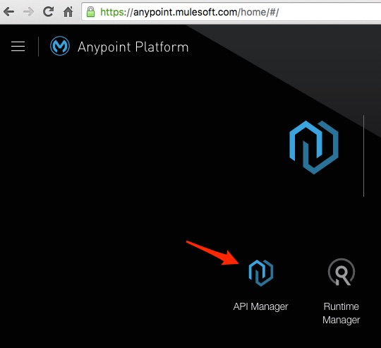
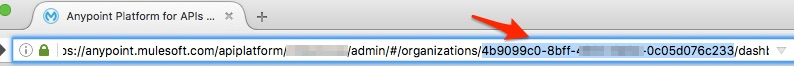
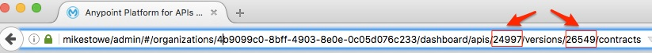
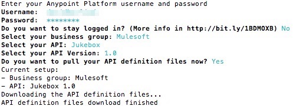

# api-sync-tool
API-Sync is a tool that synchronizes an API design (and all the related assets; files, directories, etc.) that's hosted in the [Anypoint Platform](http://anypoint.mulesoft.com) with a local filesystem (or vice versa). There are several use cases where this would come in very handy. 

**Use Case #1:** Designing a [RAML-based](http://raml.org) API on a Mac/Windows/Linux desktop and migrating that design to Anypoint.

There are various tools for designing RAML-based APIs. You could create an account on the Anypoint platform and use the Web-based API Designer which is built into that platform's API Manager section:



Or, you can run your own version of [API Designer](https://www.npmjs.com/package/api-designer). Since it's a Web app that runs on node.js (server-side Javascript), you can "serve" API Designer from the Web server of your choice or even locally from a Web server on your desktop or notebook. Another desktop/notebook alternative is to run the [Atom Integrated Development Environment (IDE)](http://atom.ie) with the [API Workbench](http://apiworkbench.com/) plug-in.

As you code and save your RAML-based designs, eventually, you will want to upload those designs to a platform like Anypoint where they (and their APIs) can be hosted and managed. API-Sync is a command line utility that can do this in a cinch. You just need to know how to feed it the right parameters (more on that in a bit).

**Use Case #2:** Collaborating on an API design with other API designers and using a version control and code repository system like [Github](http://github.com) as the central remote repository. As with the first use case, Atom makes for a great RAML-design editor in this sort of collaborative context because of its robust support for the git protocols and because of the API Workbench plug-in. If you have control over the central remote repository (ie: your own OS X or Linux-based git server), then, when a RAML-based design is finalized and saved in that server's filesystem, API-Sync can be run from there to sync that design to the Anypoint platform.

To install API-Sync, the host system will need to be running node.js. So, if you're not already running node, be sure to install it (here's one [installation tutorial](http://blog.teamtreehouse.com/install-node-js-npm-mac) that's pretty good for Mac OS X and [another for Windows](http://blog.teamtreehouse.com/install-node-js-npm-windows)). Then, install api-sync with:

```
npm install -g api-sync
```

Next, assuming you have an API design to sync and an account on the Anypoint platform, it's time to run API-Sync. Before running API-Sync though, you should change directories to the same directory where the root RAML file of the design you want to sync to Anypoint is stored. Where the option exists to supply the name of the root RAML file as a parameter, that parameter can only be the filename (in other words, no path). So, it's important for your working directory to be the same one as where the root RAML file is kept or API-Sync will not work.

Running API-Sync by itself will result in a display of API-Sync's usage guidelines.

```
api-sync
```

## Information You Will Probably Need Before Starting
To achieve a proper API sync to Anypoint, you should be ready with the following information (this document will explain how to find some of these data):

1. Your Anypoint username and password
2. The Anypoint Business Group ID that the synched API design will live under
3. The Name of the API as you want it to appear on Anypoint (this is only needed when you're using API-Sync to add a new API to Anypoint)
4. If you are synching your design with an existing API that's already listed in your API Manager, you will need the API's Anypoint ID and the API's Anypoint Version ID
5. The API's version number (ie: 1, 1.1, 2, etc). Where version number is required as a parameter, trailing zeroes are truncated. For example, "1.0" will be turned into "1". Like with API Name (see point 3), this parameter is only needed when you're using API-Sync to add a new API to Anypoint.

### Finding the Anypoint Business Group ID
As of the publication of this document, there is no menu-driven way to report on the Business Group ID from within the Anypoint platform. But the easiest way to find it is to inspect the URL while your browser is looking at an existing API or at the API Manager home page where all your APIs are listed. The Business Group ID is the full set of number and digits that appears after the part of the URL that says "/organizations/" (highlighted in the screenshot below):



### API Name, API ID and API Version ID
When looking to work with an API design that already exists on Anypoint, the safest and only way to refer to that existing design for the purposes of synching with it is by a combination of the API ID and the API Version ID. Like with the Business Group ID, this can be retrieved by looking at the URL when viewing any version of an API. In other words, with your browser pointing to Anypoint's API Manager, you must first select an API, and then select a version of that API. The resulting URL will contain the API's ID (right after the string "/apis/") and its version ID (right after the string "/versions/").



However, if you're working on a design for an API that does not yet exist on Anypoint, then you have no idea what API ID and what API Version ID will be assigned to it. In this case, you will need to invent a name and a version number before you start synching.

## Available options
Listed below are the main options that are available to the API-Sync utility. Each option, with examples, is explained in more detail below the list.

- no options: displays API-Sync usage and syntax.
- setup: Allows user to select the Business Group and API Version that will be synchronized in the working directory.
- create: Uploads a new API from the local system to the Anypoint Platform
- pull: Downloads all the files from the selected API.
- push: Uploads the new and changed files and deletes the deleted files.
- status: Shows the working directory (and subdirectories) status (added, deleted and changed files).
- cleanup: Removes metadata associated with the working directory (BizGroup and API choices, stored credentials, etc.)

### How API-Sync Setup Works
Note that you do NOT have to run the setup option before running API Sync. So why run it? Because when you run setup (with no parameters), it will set your context for future api-sync activities. For example, when you run setup, it will ask you which Business Group you want to work with (and give you a list to pick from that's based on your Anypoint credentials), which API you want to work with (or if you are going to be creating a new one), and which version of that API you're going to work with. Once you've run setup and set your API-Sync context, you will not have to re-supply those parameters while you work on the same API in the same working directory. If you switch working directories after having run setup (for example, to work on a different API), API Sync will fail. Whenver you know you need to change your context (your working directory, the API and version of it you're working with, the Business Group, etc.), you should always run the cleanup option first:

```
api-sync cleanup
```

Then, run setup again, or bypass setup and use some of the more advanced commands that accept the various parameters (discussed below). Be aware that when you run one of those advanced commands, it will set your context (using whatever parameters you supplied) as though you actually ran setup to begin with. So, you still need to run cleanup when you want to reset your context.

Remember that api-synch should always been run from the working directory where the root RAML file is kept.

To run API Sync Setup:

```
api-sync setup
```

- It starts by asking you for your Anypoint Username and Password.
- Next, it will ask if you want to stay logged-in. If you answer "Yes," then your system will be issued an access token (kept in a hidden file in the user's home directory). This token has an expiration time that can be configured by the organization admin. But as long as the token does not expire (and as long as you have not run cleanup), subsequent attempts to run API Sync will not require entry of Username and Password.
- Next, you will be presented with a choice of Business Groups. Once you select a Business Group (by name), API Sync will remember that too (for the next time you run it). In other words, you will not have to supply that parameter. If there is only one Business Group listed, press the enter key. If there's more than one, you can arrow through the list.
- Then, you will presented with a list of APIs to work with and after that, a list of specific versions. Please note that when working with the interactive version of setup, you're essentially setting these parameters so that they continue to apply through multiple runs of API-Sync. To clear all the settings and start fresh (for example, if you're going to work with a different API, run "api-sync cleanup")
- Once you've indicated which existing API you're going to work with, you'll be asked if you want to pull your API definition now. Answering yes will download the selected API design and all supporting files to the current working directory. You would probably do this in a case where you're going to manipulate the design with a local tool like API Designer or Atom (running the API Workbench plug-in). Just remember that once you change the design, you might want to sync the new design to Anypoint under a new version number. If you answer "no" to this question, then API-Sync won't do the pull, but it will remember what you've established for the different parameters so that you don't have to resupply that information on subsequent runs. The screenshot below gives you some idea of what the interactive version looks like after answer "yes" to the pull question.



Setup can also be run in non-interactive mode by supplying the parameters that the interactive mode normally asks for. Read the section below on **api-sync create** to understand the exact syntax for supplying each parameter. The usage is as follows:

```
api-sync setup --bizGroup=(Business group id) --api=(API id) --apiVersion=(API version id) -p
```

The **-p** option is optional and will invoke a pull that pulls the that API's design (the one identified by the combination of Business Group, API ID, and API Version ID) and all its files and directories into the current working directory (read more on **api-sync pull** later in this doc).

### How API-Sync Create Works
The create option is perfect for taking a newly designed API and uploading it to the Anypoint platform. Remember that api-synch should always been run from the working directory where the root RAML file is kept. Here is the syntax and then some example usages:

Syntax:

```
api-sync create --bizGroup=(Business group id) (--apiName=(API name)|--apiId=(API id)) --apiVersion=(API version name) --rootRaml=(root Raml file)
```

**Example usage when syncing a new API**

Suppose the following is true:
- You want to name your new API to be "Acme"
- The version of the new API is "1" (api-sync truncates any trailing zeroes, as in "1.0")
- The Business Group is "12345"
- The root RAML file is "acme.raml"

Then the usage would be as follows:

```
api-sync create --bizGroup=12345 --apiName=Acme --apiVersion=1 --rootRaml=acme.raml
```

If you wanted the name of the API to be "Acme Customer" and you wanted to do a pull, then the usage would be as follows (note the quotation marks):

```
api-sync create --bizGroup=12345 --apiName="Acme Customer" --apiVersion=1 --rootRaml=acme.raml -p
```

**Example usage when adding a new version to an API that already exists on the Anypoint platform**
In this case, you will need Anypoint's ID of the existing API

Suppose the following is true:
- The existing API's ID is "54321"
- The version number of the new version is "1.1"
- The Business Group is "12345"
- The root RAML file is "acme.raml"

Then the usage would be as follows:

```
api-sync create --bizGroup=12345 --apiID=54321 --apiVersion=1.1 --rootRaml=acme.raml
```

Without parameters, **api-sync create** will run in interactive mode and ask you for the information.

## How API Sync Push Works
Once your context is set (either by running setup or running create), you can make changes to the API's design or its related assets (files, directories, etc.) and simply run a push without supplying parameters and the new package will be pushed up to Anypoint (replacing the existing one). So, you have to be EXTREMELY careful with this option because you don't want to overwrite something like an active API by mistake. Like a good version control system, API Sync is smart enough to know if any of those assets have changed. If none have changed, it will report that there's nothing to push.  Usage:

```
api-sync push
```

## How API Sync Pull Works
Same as push, but in reverse. Once your context is set by running setup or create, running an **api-sync pull** will pull a design and all associated assets down from Anypoint into the current working directory. Usage:

```
api-sync pull
```

## How API Sync Cleanup Works
As mentioned earlier, there are various ways to set the working context of API Sync; basically running either the interactive or non-interactive modes of setup and create. Running cleanup wipes out that context. If you try to work on a different API without running cleanup first, API Sync will fail. Usage:

```
api-sync cleanup
```

## Reminder regarding keeping users logged in
As said earlier, to keep users logged in, this tool stores an access token in a hidden file in the user's home directory. This token has an expiration time that can be configured by its organization admin.

## Developing

Using the local code version:
```
npm install

npm link

api-sync
```
